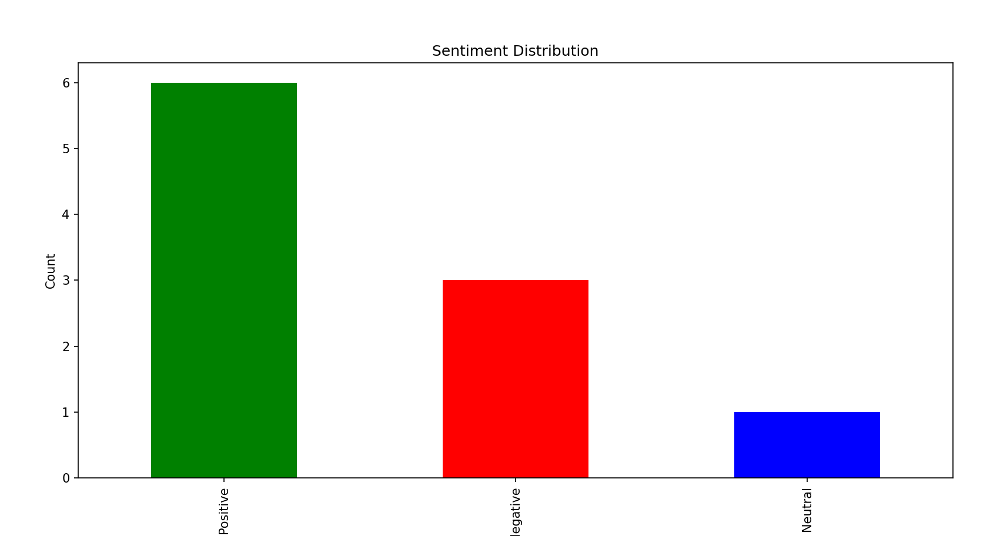

# sentiment-analysis-offline
Offline Sentiment Analysis on sample Twitter data using Python.
# Sentiment Analysis of Social Media Data (Offline Version)

## Overview
This project is a sentiment analysis tool that processes social media text data (offline sample tweets) to classify the sentiment as positive, negative, or neutral. It leverages the Python library **TextBlob** for natural language processing and sentiment polarity detection.

## Features
- Offline sentiment analysis using sample tweet data (CSV file)
- Preprocessing of text data (cleaning and tokenization)
- Sentiment classification using TextBlob's polarity score
- Visualization of sentiment distribution using Matplotlib
- Simple, easy-to-understand Python implementation

## Technologies Used
- Python 3.x
- TextBlob (NLP library)
- Pandas (data manipulation)
- Matplotlib (data visualization)

## How to Run
1. Clone the repository:
   ```bash
   git clone https://github.com/poushali-pp/sentiment-analysis-offline.git

2. Install dependencies
   pip install -r requirements.txt

3. Run the main script
   python sentiment_analysis.py

Future Improvements
 - Integrate real-time Twitter data using Tweepy API

 - Use advanced NLP models (like BERT) for better accuracy

 - Handle sarcasm and context ambiguity in tweets

- Develop a web-based dashboard for visualization

 ## SAMPLE OUTPUT 
    
